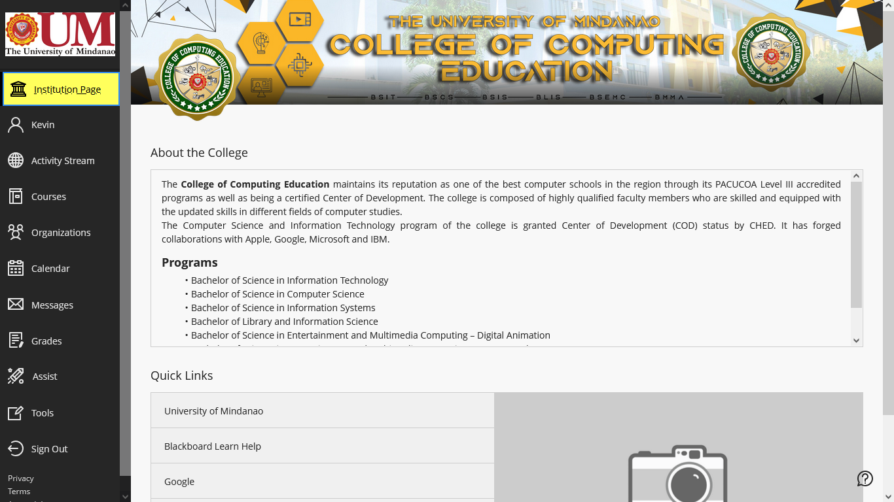
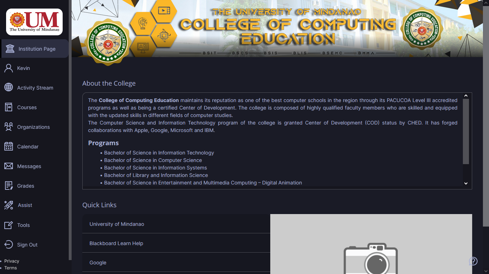
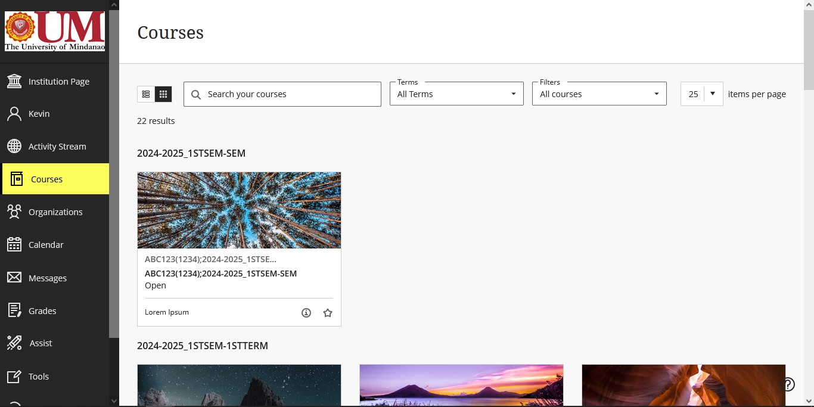
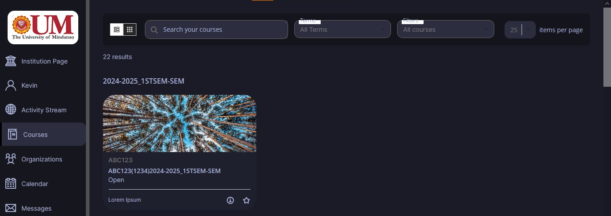
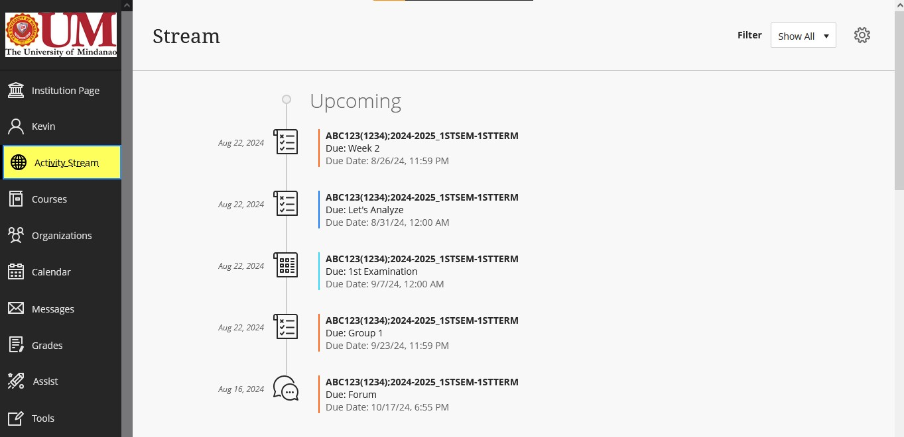
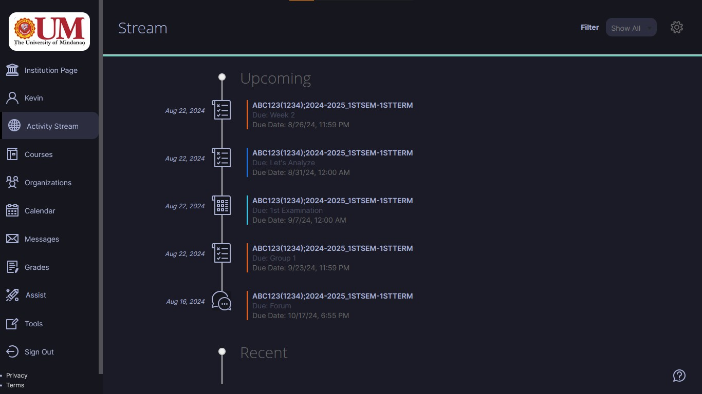

<h1> Dark Blackboard Theme </h1>

This is a custom userstyle that will be used with [Stylus](https://github.com/openstyles/stylus) extension. It is an alternative theme for Blackboard. The theme colors are based on [enkia Tokyo Night theme](https://github.com/enkia/tokyo-night-vscode-theme ) on Visual Studio Code.
> [!WARNING]
> This repository is still in development and may contain a significant number of bugs, incomplete features, or other issues. 
> The author welcomes contributions! Check [Contributing](#contributing)
## Features
- Rounded corners
- Hover border outer glow
- and many more... TBA
## Screenshots
| Default Blackboard Theme | Dark Blackboard Theme |
|--------|-------|
|  |  |
|  |  |
|  |  |

## Installation
1. Install :art: **Stylus** extension for [Google Chrome](https://chromewebstore.google.com/detail/stylus/clngdbkpkpeebahjckkjfobafhncgmne) or [Firefox](https://addons.mozilla.org/en-US/firefox/addon/styl-us/) or [Opera](https://addons.opera.com/en-gb/extensions/details/stylus/)
> :warning: **Note:**
> The theme was tested in Firefox and may not work properly in other browsers. Compatibility with browsers other than Firefox is not guaranteed. See [Future Plans](#future-plans)
2. Install via Stylus (supports automatic updates)

or manually install by copy pasting the [usercss](https://github.com/kvnmcn/Blackboard-Theme/raw/main/theme.user.css)

## Contributing
1. Fork or download the repository
2. Create your own branch
3. Make your changes
4. Submit a pull request: Open a pull request with a clear description of the changes and how they address the issues. Include any relevant details about what you’ve done and why.

## Future Plans
- Improve compatability with other browsers and media screens
- Create a website index where multiple themes are gathered
- Fix a lot lot lot of :bug: bugs
- Add more themes :sweat_smile: :heart:
## Disclaimer
> [!NOTE]
> The author of this project make no warranties about the software and are not liable for any issues or damages resulting from its use.
> The author of this project is a student at University of Mindanao and is working on this project independently. The project is **not affiliated with or endorsed by** the university in any official capacity.

## License
This project is licensed under [MIT](https://github.com/kvnmcn/Blackboard-Theme/blob/main/LICENSE) license.
